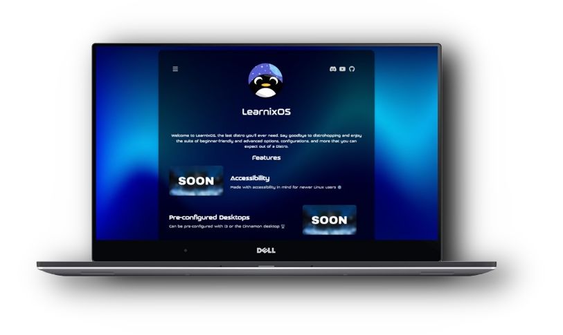
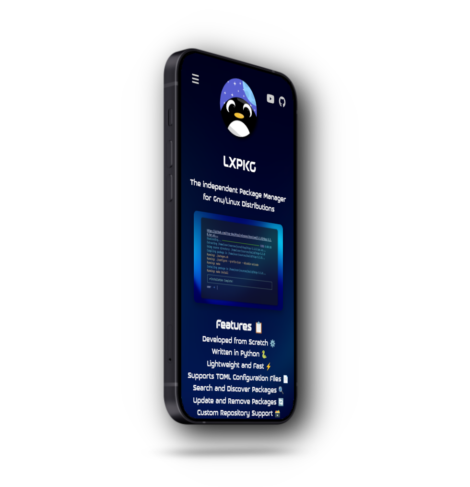

  <h2 style="font-size: 74px;">
    <strong> 
      <a href="https://learnixos.github.io/" style="text-decoration: none; color: inherit;">
        𝗟𝗲𝗮𝗿𝗻𝗶𝘅𝗢𝗦
      </a> 
    </strong>
  </h2>

<h1>
      

 

### A distribution that:

  ###  Is aligned with scalability and accessibility, meant specifically for inexperienced users.
  ### Is pre-configured for an i3 and Cinnamon desktop respectively.
  ###  An offering to those who are interested in learning about compilation-based distributions, with a custom package manager.
  ###  Offers source-based packages being compiled with pms, our own package manager.
  ###  Is completely GPL_3.0, We will remain open source. 🔥

### **Thanks to the contributions of:**
  - Ping (Opposite34) | Current Head Maintainer of the LearnixOS website
  - (coming soon)

<h1>
      

 

# **Status**

